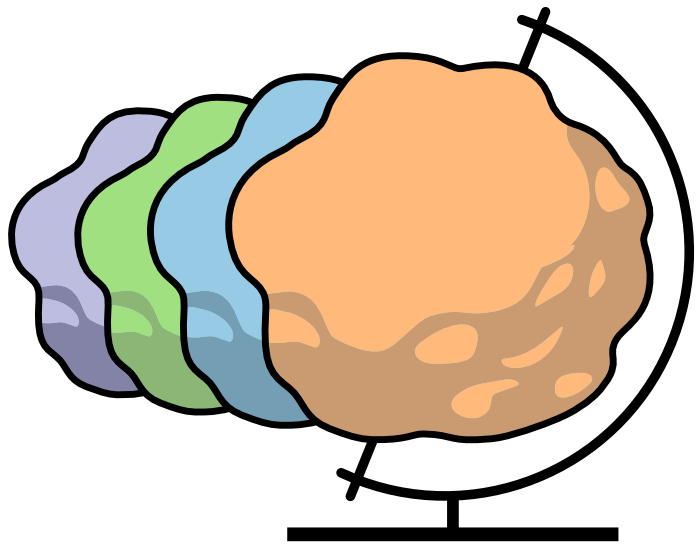

[](https://badge.fury.io/py/hnoca)
[]()
[](https://github.com/psf/black)

# Human Neural Organoid Cell Atlas Toolbox
#### 🛠️ The Swiss Army Knive of the Single Cell Cartographer



This package provides a set of tools we used to generate and analyze the Human Neural Organoid Cell Atlas. Among other things, it provides functions to:

- Rapidly annotate cell types based on marker genes
- Map query data to the reference atlas
- Transfer annotations between datasets
- Compute 'presence scores' for query data based on the reference atlas
- Perform differential expression analysis


## Installation
The latest release of HNOCA-tools can be installed with `pip`

```
pip install hnoca
```


## Quick start

### 🖋️ Annotation 

We developed [snapseed](https://github.com/devsystemslab/snapseed) to rapidly annotate the HNOCA. It annotates cells based on manually defined sets of marker genes for individual cell types or cell type hierarchies. It is fast (i.e. GPU-accelerated) and simple to enable annotation of very large datasets.

```python
import hnoca.snapseed as snap
from hnoca.snapseed.utils import read_yaml

# Read in the marker genes
marker_genes = read_yaml("marker_genes.yaml")

# Annotate anndata objects
snap.annotate(
    adata,
    marker_genes,
    group_name="clusters",
    layer="lognorm",
)

# Or for more complex hierarchies
snap.annotate_hierarchy(
    adata,
    marker_genes,
    group_name="clusters",
    layer="lognorm",
)
```

### 🗺️ Mapping

For reference mapping, we mostly rely on [scPoli](https://docs.scarches.org/en/latest/scpoli_surgery_pipeline.html) and [scANVI](https://docs.scvi-tools.org/en/1.1.1/user_guide/models/scanvi.html). Based on pretrained models, we here provide a simple interface to map query data to the reference atlas.

```python
import scvi
import hnoca.map as mapping

# Load the reference model
ref_model = scvi.model.SCANVI.load(
    os.path.join("model.pt"),
    adata=ref_adata,
)

# Map query data
mapper = mapping.AtlasMapper(ref_model)
mapper.map_query(query_adata, retrain="partial", max_epochs=100, batch_size=1024)
```

Now that the query dataset is mapped, we can perform kNN-based label transfer and presence score calculation.

```python
# Compute the weighted kNN
mapper.compute_wknn(k=100)

# Transfer labels
celltype_transfer = mapper.transfer_labels(label_key="cell_type")
presence_scores = mapper.get_presence_scores(split_by="batch")
```

### 📊 Differential expression

We have used ANOVA for DE analysis between the HNOCA and the reference atlas. Here, this is implemented as the `test_de()` function.

```python
import hnoca.stats as stats

# Perform DE analysis
de_df = stats.test_de(
    joint_adata,
    group_key="origin",
    return_coef_group="organoid",
    adjust_method="holm",
)
```

In addition to DE testing on the atlas itself, we found it useful to treat the atlas as a universal "control" and test for DE w.r.t query datasets. For this, we first compute the matched expression profile for each cell in the query dataset and then test for DE using an F-test.

```python
# Compute matched expression profiles based on mapped data
matched_adata = mapper.get_matched_expression()

# Perform DE analysis
de_df = stats.test_de_paired(
    query_adata,
    matched_adata,
    adjust_method="holm",
)
```

